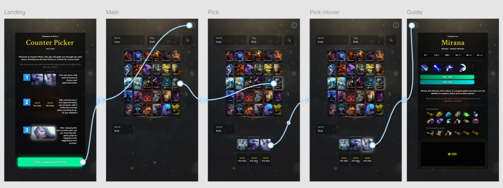

# **Mockups - Dota 2 Counter Picker**

## **Enlace al proyecto**
Acceder a los mockups interactivos desde el siguiente enlace:  
[Dotapicker Mockups - Figma](https://www.figma.com/proto/q3qUzYsU3TWgXhwSQ0DVCI/Dota-2-Counter-Picker?node-id=0-1&t=7tUk3QF7N9EpRkFg-1)

---

## **Pantallas**

### **1. Pantalla de inicio**: 

Inicia describiendo el funcionamiento básico del aplicativo en forma de lista de pasos.

### **2. Pantalla principal**: 

Se muestra la lista completa de heroes, con posibilidad de filtrar por línea o rol, e incluye el botón de búsqueda textual. Una vez seleccionados el/los oponente(s), las sugerencias se mostrarán en la parte inferior a modo del retrato del héroe y su respectivo winrate. Las sugerencias también pueden ser presentadas por filtro de roles.

### **3. Pantalla guías**: 

De acuerdo al counter pick seleccionado, se muestra una guía de juego propia a la selección, items iniciales, levelización y consejos útiles.

**Captura del Mockup:**  

---
